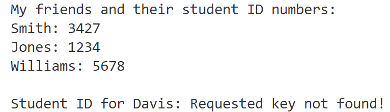

# Mastery Check: Using `get()` with a Python Dictionary

## Directions
- Create a NEW GitHub repo: **mc-dict-get**
- Add a `main.py` file to your repo 
- No need to share your repo with your teacher
- Bring your workstation up to your teacher when you are finished so he can check your code 

## Your Code

- Use a Python dictionary to store the last names of three of your friends and their four-digit student ID numbers
  - Example: Bob Smith's student ID number is: 9812
- Your keys will be each person's last name
- Your values will be the person's student ID number
 
- Print all the key:value pairs in your dictionary
- Then use the `get( )` method -- along with a default value -- to request a dictionary key that might (or might not) exist in your dictionary
  - If the requested key doesn't exist, use the `get( )` method to display a default value that says: **'Requested key not found!'**

---

## Sample Output

