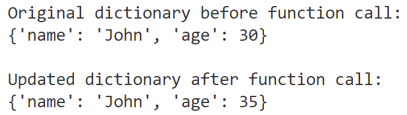

# Mastery Check: Writing a Function To Update a Python Dictionary

## Directions
- Create a NEW GitHub repo: **mc-dict-update-function**
- Add a `main.py` file to your repo 
- No need to share your repo with your teacher
- Bring your workstation up to your teacher when you are finished so he can check your code 

## Your Code

- Write a simple Python function named `update_my_dict()` that takes three (3) parameters:
  - `my_dict`
  - `key`
  - `value`
- The function will update the value of the specified key in the dictionary and return the **updated** dictionary
- Before you call the function, please print the ORIGINAL dictionary
- After calling the function, print the **updated dictionary**

---

## Sample Output

